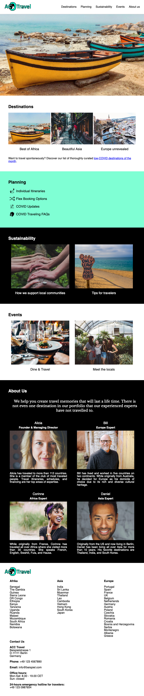
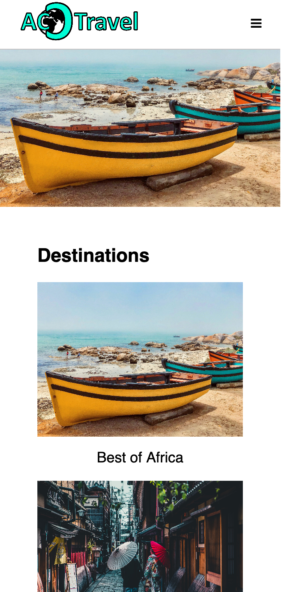

# ACC Travel
This project is inspired by CodeCademy. It's a website for a fictional travel agency. 

## Description
The task was to create a (real or fictional) company website including content, logo, mission or brief company description, a set of images to represent the company's products, and a section describing the company's employees. 

I created a fully-fledged travel agency homepage including versions for mobile, tablet, and desktop. The design process included several steps such as a travel trend research, business model canvas creation, information architecture design, wireframing, and graphic design. 

## Desktop
 

 

## Tablet

 

 

## Mobile

 

 

## Built with

* Visual Studio Code
* HTML5
* CSS3 (flexbox, responsive design)
* JavaScript
* Markdown
* Unsplash.com, image credits (ordered by image appearance on the site):
    * Ian Badenhorst
    * Andre Benz
    * Micaela Parente
    * Shane Rounce
    * Nick Fewings
    * Jay Wennington
    * Brooke Cagle
    * Valdemars Magone
    * Robert Godwin
    * Eye For Ebony
    * Joseph Gonzales

## Run
Download the respository and open index.html in a browser. 
